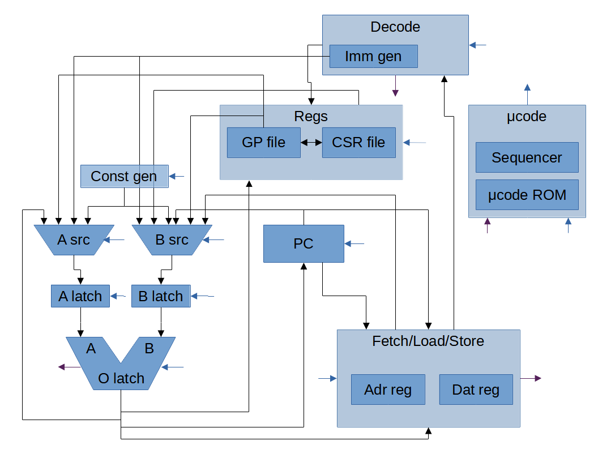

# Sentinel Internal Structure

<!-- Click each block in the below image to go to documentation for (_roughly_) each
{py:class}`~amaranth.lib.wiring.Component` of Sentinel. -->

## Block Diagram

Below is a simplified block diagram of Sentinel, showing how the main {py:class}`~amaranth.lib.wiring.Component`s
connect to each other. Behavior of `Components` not represented in the block
diagram will be explained in the next sections.

 

Blue arrows represent outputs from the microcode ROM's data [Signal](https://amaranth-lang.org/docs/amaranth/latest/guide.html#signals)s,
while purple arrows represents inputs from each `Component` back to the
microcode ROM address `Signal`s. A blue arrow _into_ the microcode ROM reflects
the fact that some microcode data outputs feed back into the ROM's
address as inputs.

<!-- TODO: Block Diagram Map. Use the below as a starting point.

<map name="blockdiag">
    <area shape="rect" coords="517,116,648,242" href="#microcode-rom">
    <area shape="rect" coords="242,116,446,200" href="#register-file">
    <area shape="rect" coords="290,248,380,290" href="#sentinel.datapath.ProgramCounter">
    <area shape="rect" coords="356,16,518,84" href="#instruction-decoder">
    <area shape="rect" coords="60,362,210,438" href="#arithmetic-logic-unit-alu">
    <area shape="rect" coords="30,170,260,372" href="#alu-sources">
    <area shape="rect" coords="372,364,575,472" href="#fetch-load-store-unit">
</map>

 -->


## Register File

```{eval-rst}
.. automodule:: sentinel.datapath
    :members:
```

## Microcode ROM and Control

```{eval-rst}
.. automodule:: sentinel.ucoderom
    :members:
```

```{eval-rst}
.. automodule:: sentinel.control
    :members:
```

<!-- FIXME: I'm tired of writing. Convert this to Markdown later. -->

```{eval-rst}
.. _mapping-details:

Mapping Details
---------------

At present (1/6/2025), I mostly hand-calculated the :class:`~sentinel.control.MappingROM`
jump table. Many  RV32I :class:`instruction bits <sentinel.insn.Insn>` can
be reconstructed by other microcode fields after
:class:`decoding <sentinel.decode.Decode>`, such as
:class:`operand sources <sentinel.ucodefields.RegRSel>` and
:attr:`immediates <sentinel.ucodefields.ASrc.IMM>`. From there, I found a
reasonably small map in terms of combinational logic by playing with the
remaining instruction bits- mostly
:class:`major <sentinel.insn.OpcodeType>` and
:attr:`minor <sentinel.insn.Insn.funct3>` opcodes- in a text file:

.. code-block::

    LOAD =      0b00001000 0x08
                0b00001001 0x09
                0b00001010 0x0A
                0b00001100 0x0C
                0b00001101 0x0D
    MISC_MEM =  0b00110000 0x30
    OP_IMM =    0b01000000 0x40
                0b01000010 0x42
                0b01000011 0x43
                0b01000100 0x44
                0b01000110 0x46
                0b01000111 0x47
                0b01000001 0x41
                0b01000101 0x45
                0b01001101 0x4D
    AUIPC =     0b01010000 0x50
    STORE =     0b10000000 0x80
                0b10000001 0x81
                0b10000010 0x82
    BRANCH =    0b10001000 0x88
                0b10001001 0x89
                0b10001100 0x8C
                0b10001101 0x8D
                0b10001110 0x8E
                0b10001111 0x8F
    JALR =      0b10011000 0x98
    JAL =       0b10110000 0xB0
    OP =        0b11000000 0xC0
                0b11000001 0xC1
                0b11000010 0xC2
                0b11000011 0xC3
                0b11000100 0xC4
                0b11000101 0xC5
                0b11001101 0xCD
                0b11000110 0xC6
                0b11000111 0xC7
                0b11001000 0xC8
    SYSTEM =    0b11000000 0xC0 (handled specially)
                0b11000000 0xC0 (handled specially)
    LUI =       0b11010000 0xD0

    CSRs are placed wherever they fit; I chose 0x24 as a starting point.

CSR compression relies on the fact that Sentinel doesn't actually implement
most CSRs, and so their addresses can be treated as blanket
`don't cares <https://en.wikipedia.org/wiki/Don%27t-care_term>`_:

.. code-block::

    mstatus   0x300 => 0b001100000000 => 0bxxxxx0xxx000 => 0b0000 - ffs
    mie       0x304 => 0b001100000100 => 0bxxxxx0xxx100 => 0b0100 - ffs
    mtvec     0x305 => 0b001100000101 => 0bxxxxx0xxx101 => 0b0101 - bram
    mscratch  0x340 => 0b001101000000 => 0bxxxxx1xxx000 => 0b1000 - bram
    mepc      0x341 => 0b001101000001 => 0bxxxxx1xxx001 => 0b1001 - bram
    mcause    0x342 => 0b001101000010 => 0bxxxxx1xxx010 => 0b1010 - bram
    mip       0x344 => 0b001101000100 => 0bxxxxx1xxx100 => 0b1100 - ffs

Of course, if I physically implement more registers, the table will need
to change, up to and including using more than 16 addresses :).

.. todo::

    * Perhaps include rest of the raw notes on how I derived start
      locations from opcodes; right now only the results are included.
    * Start locations need to be documented as constants, including "base"
      constants where the minor opcode is just added to the base to form
      the final constant.
```

## Instruction Decoder

```{eval-rst}
.. automodule:: sentinel.decode
    :members:
```

```{eval-rst}
.. automodule:: sentinel.insn
    :members:
```

## Arithmetic Logic Unit (ALU)

```{eval-rst}
.. automodule:: sentinel.alu
    :exclude-members: ASrcMux, BSrcMux
```

## Exception Control

Exception control has not yet been incorporated into the above block diagram.

```{eval-rst}
.. automodule:: sentinel.exception
    :members:
```

## ALU Sources

The {py:class}`~sentinel.alu.ALU`'s two inputs `A` and `B` are fed by two
separate muxes. Each mux can choose from one of up to 8 data sources. Not all
data sources are shared between the two muxes.

```{eval-rst}
.. autoclass:: sentinel.alu.ASrcMux
    :members:
```

```{eval-rst}
.. autoclass:: sentinel.alu.BSrcMux
    :members:
```

These muxes and latches live in the implementation of {py:class}`~sentinel.top.Top`.

## Fetch/Load/Store Unit

The Fetch/Load/Store Unit is implemented in-line in {py:class}`~sentinel.top.Top`
using the components from the {py:mod}`~sentinel.align` module.

```{eval-rst}
.. automodule:: sentinel.align
    :members: 
```

Aside from aligning, the glue logic for latching addresses, read data, and
write data is minimal and controlled directly by
{mod}`microcode signals <sentinel.ucodefields>`.

## Instruction Cycle Counts

```{todo}
I need to create a test that gets latency and throughput for each instruction
type of the core.
```

The following counts are general observations (as of 11/18/2023), from
examining the microcode (knowing that each microcode instruction always takes
1 clock cycle):

* _There is room for improvement, even without making the core bigger._
* Fetch/Decode takes a _minimum_ of two cycles thanks to Wishbone classic's
  REQ/ACK handshake taking two cycles.
  * When Wishbone ACK is asserted, Decode is taking place.
  * The GP file is a synchronous single read port, single write port. Sentinel
    loads RS1 out of the register file during Decode.
* All instructions share the same operation the cycle after ACK/Decode:
  * Check for exceptions/interrupts, go to exception handler if so.
  * Latch RS1 into the ALU.
  * Load RS2 out of the register file, in anticipation for a "simple"
    instruction.
  * Jump to the instruction-specific microcode block.
* At minimum, an instruction (`addi`, `or`, etc) takes 3 cycles to retire
  after the initial shared cycles. This means Sentinel instructions have a
  minimum latency of 6 cycles per instruction (CPI).
  * I define "retirement" to mean "cycle in which we return to the Fetch/Decode
    or Exception Checking part of the microcode program". This usually
    corresponds to "cycle after RD/PC was written with results".
* Sentinel instructions have a maximum throughput of 4 CPI by overlapping the
  2 Fetch/Decode cycles of the _next_ instruction after the initial 3 shared
  cycles of the _current_ instruction when possible ("pipelining").
  * Some instructions overlap one of the Fetch/Decode cycles, some don't
    overlap either of them. In particular, shift instructions with a nonzero
    shift count don't pipeline Fetch/Decode. It may be possible to _always_ 
    overlap at least one cycle, but I haven't tweaked the core yet to ensure
    this is a sound optimization.
* _Shift instructions need work_:
  * For a shift of zero, shift-immediate latency is 10 CPI, throughtput 9 CPI.
    Shift-register latency is 11 CPI, throughput 10 CPI.
  * For a shift of nonzero `n`, shift-immediate _and_ shift-register latency
    and throughput is 7 + 2*`n` CPI.
* Branch-not-taken latency and throughput is 7 CPI. Branch-taken latency and
  throughput is 8 CPI.
* JAL/JALR latency is 9 CPI, throughput is 7 CPI.
* Store latency and throughput is 10 CPI minimum. 2 cycles minimum are spent
  waiting for Wishbone ACK.
  * The core _will_ release STB/CYC between the store and fetch of the next
    instruction.
* Load latency is 10 CPI minimum, and throughput is 9 CPI. 2 cycles minimum
  are spent waiting for Wishbone ACK.
  * The core _will_ release STB/CYC between the load and fetch of the next
    instruction.
* CSR instructions require an extra Decode cycle compared to all other
  instructions (to check for legality).
  * At minimum, a read of a read-only zero CSR register has a latency of 7 CPI,
    and a throughput of 6 CPI.
  * At maximum, `csrrc` has a latency of 11 CPI, and a throughput of 10 CPI.
* Entering an exception handler requires 5 clocks from the cycle at which
  the exception condition is detected.
  * `mret` has a latency and throughput of 8 CPI. 

(csrs)=
## CSRs

Sentinel physically implements the following CSRs:

* `mscratch`
* `mcause`
  * The core can only physically trigger a subset of defined exceptions:
    * Machine external interrupt
    * Instruction access misaligned
    * Illegal instruction
    * Breakpoint
    * Load address misaligned
    * Store address misaligned
    * Environment call from M-mode

    In particular worth noting:
    * _Misaligned accesses are not implemented in hardware._
    * There is no machine timer (a 64-bit counter is a bit too much to
      ask for right now :(...).
* `mip`
  * Only the `MEIP` bit is implemented. The `MSIP` and `MTIP` bits always read
    as zero. The RISC-V Privileged Spec says:

    > `MEIP` is read-only in `mip`, and is set and cleared by a
    > platform-specific interrupt controller.

    The user must provide their own interrupt controller. See
    {class}`sentinel.top.Top`.
    
    One simple implementation is to `OR` all external interrupt sources
    together and feed it to the {attr}`IRQ line <sentinel.top.Top.irq>`. When
    any of the `OR` inputs are asserted, this will be reflected in the `MEIP`
    bit, indicating _at least one_ I/O peripheral needs attention. The Sentinel
    program will then query each I/O peripheral to figure out _exactly which_
    peripherals need attention. An example implementation can be found for the
    serial and timer peripherals in {mod}`examples.attosoc` and [`sentinel-rt`](./support-code.md#sentinel-rt).

    ```{note}
    In the future, I may implement the high (platform-specific) 16-bits of
    `mip`/`mie` to make interrupt-handling quicker.
    ```
* `mie`
  * Only the `MEIE` bit is implemented.
* `mstatus`
  * Only the `MPP`, `MPIE`, and `MIE` bits are implemented.
* `mtvec`
  * The `BASE` is writeable; only the Direct `MODE` setting is implemented.
  
    ```{todo}
    A read-only `BASE` is allowed, but I believe the Rust [support code](./support-code.md)
    assumes a writable `BASE`. I don't wish to fork [`riscv-rt`](https://github.com/rust-embedded/riscv/tree/master/riscv-rt)
    solely for a read-only `BASE`. So I deal with the potential loss of space
    savings for now.

    Revisit whether read-only `BASE` is feasible in the future.
    ```
* `mepc`

The following CSRs are implemented as read-only zero and trigger an exception
on an attempt to write:

* `mvendorid`
* `marchid`
* `mimpid`
* `mhartid`
* `mconfigptr`

The following CSRs are implemented as read-only zero (no exception on write):

* `misa`
* `mstatush`
* `mcountinhibit`
* `mtval`
* `mcycle`
* `minstret`
* `mhpmcounter3-31`
* `mhpmevent3-31`

All remaining machine-mode CSRs are unimplemented and trigger an exception on
_any_ access:

* `medeleg`
* `mideleg`
* `mcounteren`
* `mtinst`
* `mtval2`
* `menvcfg`
* `menvcfgh`
* `mseccfg`
* `mseccfgh`

```{eval-rst}
.. automodule:: sentinel.csr
    :members:
```
